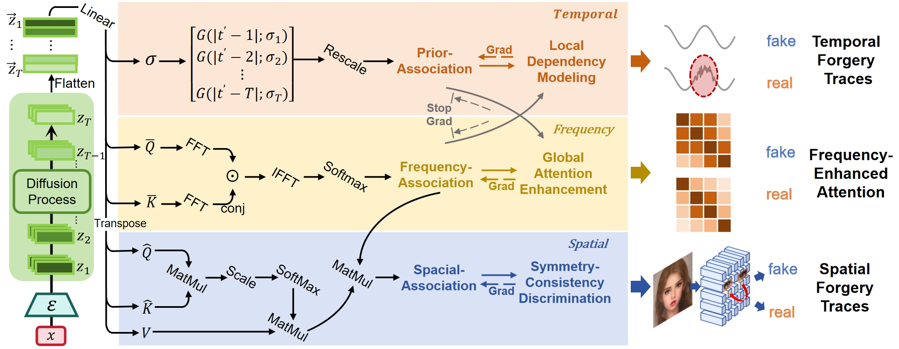
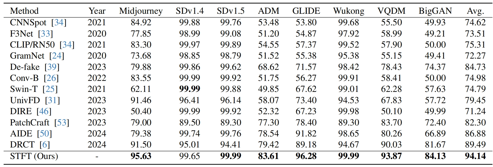
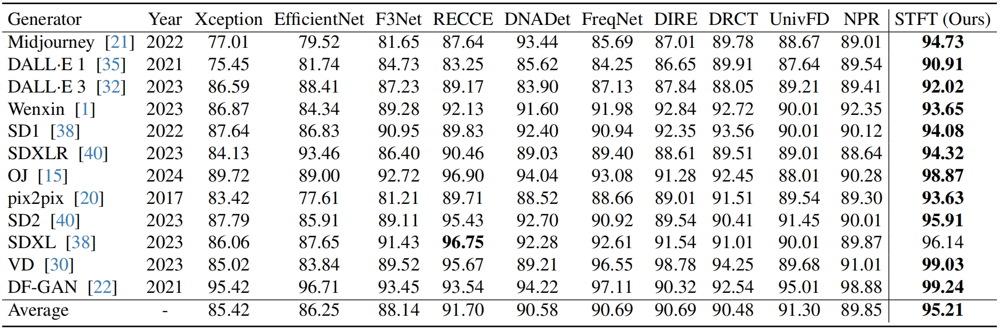

# Spatial-Temporal Forgery Trace based Forgery Image Identification

As illustrated in the figure, STFT utilizes the diffusion process to map the image into the latent distribution space and extracts forgery traces from this latent distribution through comprehensive spatial-temporal analysis. The overall framework consists of the following three main modules:

- **Temporal Prior Correlation Modeling**: Analyzes the latent space representations at different time steps of the diffusion process to capture their temporal variation characteristics.
- **Spatial Correlation Modeling**: Extracts features from different latent dimensions and computes spatial correlations using a self-attention mechanism to model spatial dependencies.
- **Frequency-Enhanced Attention Mechanism**: Leverages frequency domain information to guide temporal prior correlation computation and spatial correlation analysis, thereby accelerating forgery trace localization and improving model generalization by disregarding the interference of irrelevant features.



## Get Started

1. Install Python 3.8, PyTorch >= 2.4.

2. Porcess data to extract latent space data from the diffusion steps and process it into `test_all.csv`. Then, move the csv file to `./dataset/[dataset name]/`. The LDM pre-trained weight file we use is `configs/latent-diffusion/celebahq-ldm-vq-4.yaml`.

3. Train and evaluate. You can reproduce the experiment results as follows:

   ```bash
   python main.py --mode train --data_path dataset/[dataset name]
   python main.py --mode test --data_path dataset/[dataset name]
   ```
   

## Main Result

We follow the established comparison standards to evaluate model performance on the GenImage and DeepFaceGen datasets, using accuracy (ACC) and area under the curve (AUC) as evaluation metrics, respectively. 

Accuracy (ACC, %) comparison of our STFT method and other forgery detection models across various image generators. All methods were trained on GenImage/SDv1.4 and evaluated on different test subsets: 



Performance Comparison (AUC, %) of STFT and other methods across various forgery generators on DeepFaceGen: 

